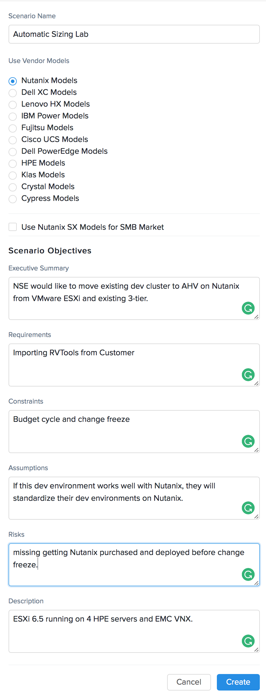
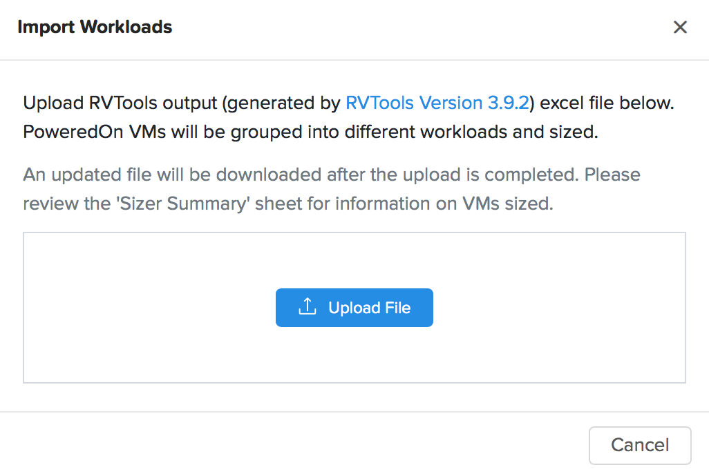
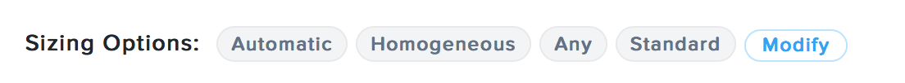
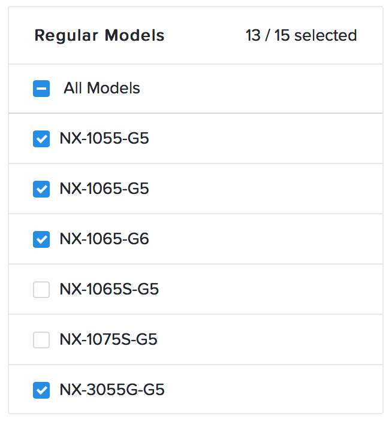

.. _lab_automatic_sizing:

----------------------
Lab - Automatic Sizing
----------------------

Overview
++++++++

Walkthrough a sizing exercise where you import a rvtools export, and review the Automatically chosen Nutanix nodes.

Automatic Sizing
++++++++++++++++

.. note::

  Please download the RVTools export below for use in this lab.
  :download:`automatic_sizing_rvtools.xlsx <./automatic_sizing_rvtools.xlsx>`

Open \http://sizer.nutanix.com

Login with your **My Nutanix Login** credentials.

Click **+ Create New Scenario**, and create a demo Scenario.

Enter the following information, and click **Create**:

- **Scenario Name** - Automatic Sizing Lab
- **Vendor Model** - Nutanix Models
- **Scenario Objectives**:
- **Executive Summary** - NSE would like to move existing dev cluster to AHV on Nutanix from VMware ESXi and existing 3-tier.
- **Requirements** - Any information you have regarding Requirements.
- **Constraints** - Any information you have regarding Constraints.
- **Assumptions** - Any information you have regarding Assumptions.
- **Risks** - Any information you have regarding Risks.
- **Description** - ESXi 6.5 running on 4 HPE servers and EMC VNX.

Click the :fa:`ellipsis-v`, and then click **Import Workloads**.

Click **Upload File**, and point to the RVTools export you downloaded above.

.. note::

  When importing RVTools into Sizer, it will only account for **Powered On** VMs.

We see that Sizer has selected a NX-1465S-G5 (4 x NX1065s-G5 Nodes).

The S signifies that this is a SMB node. Lets remove all of the SMB models as an option from the Automatic sizing.

Click on **Modify**

Locate the NX-1065S-G5 & NX-1075S-G5 under **Regular Models**, and uncheck them.

Review the other options you can change for an Automatic sizing:

- Sizing Options:
  - Cluster Type - Allows you to size with the same node type, or mixed node type.
  - Failover - Allows you to manipulate the N+* rate between 0 and 2.
  - Storage - Allows you to explicitly select Hybrid or All Flash disks.
  - Model Type - Allows you to chose the model type.
- Threshold - Allows you to change the threshold that Sizer uses for CPU/Memory/HDD/SDD

.. note::

  You can get help / explanation of an item any time by clicking on the :fa:`question-circle

When you are done reviewing the items, click **Apply**.

Takeaways
+++++++++
