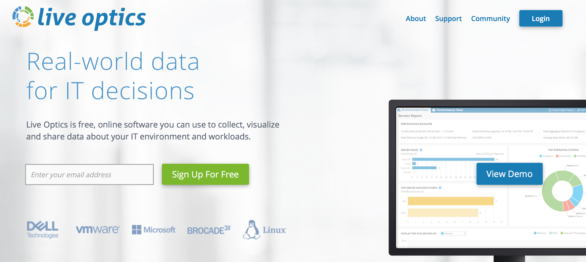
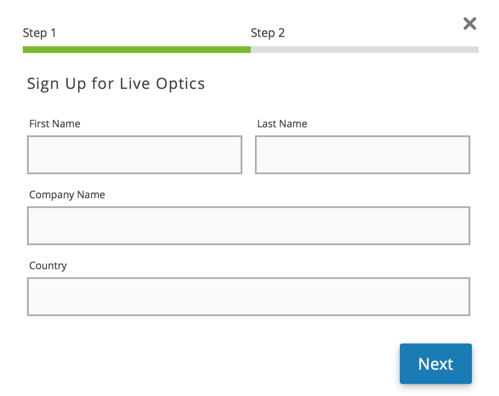
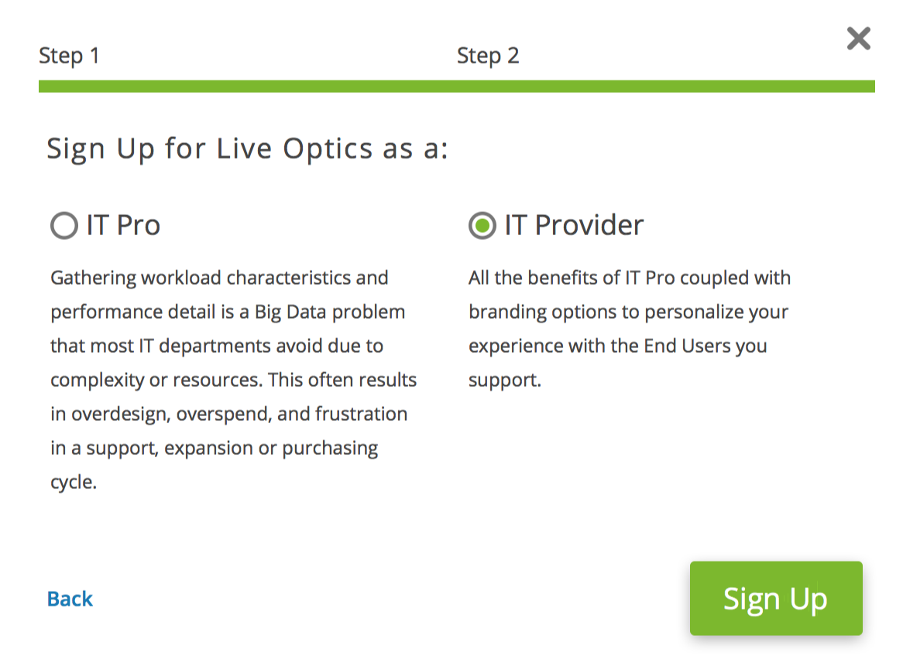
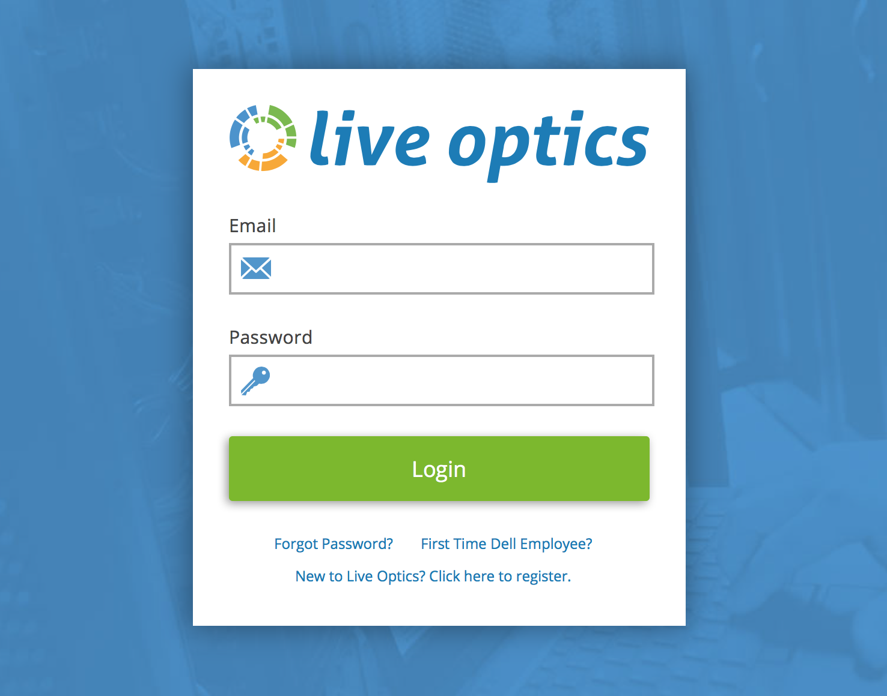
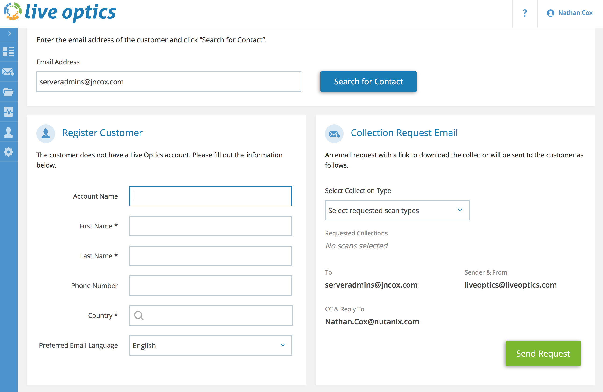
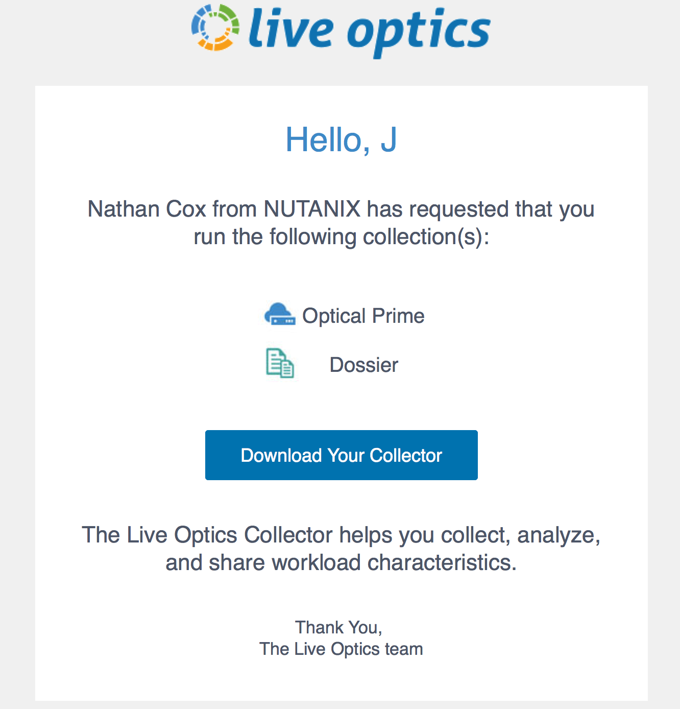
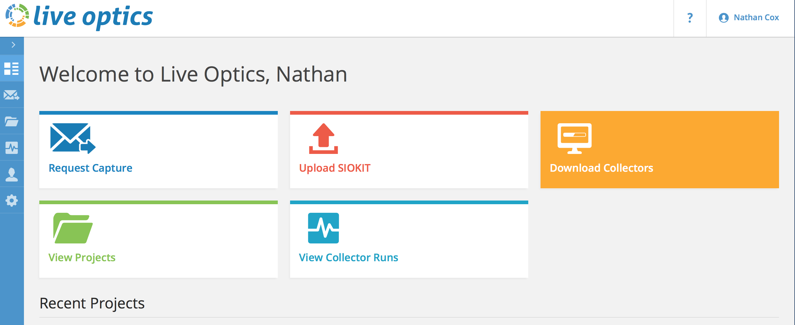

.. _live_optics:

----------------
Dell Live Optics
----------------

Overview
++++++++

.. note::

  Review :ref:`live_optics_glossary` before proceeding with the lab to familiarize yourself with common terminology used in Dell Live Optics.

In this exercise you will learn about Dell DPACK, and the information you can use for your Nutanix sizing.

What is Dell Live Optics
++++++++++++++++++++++++

Dell Live Optics is a performance collection tool.

It provides **Agentless** monitoring for the following:

- vCenter / ESXi (VMware stats)
- Windows (WMI/WBEM)
- Linux/UNIX (SSH)
- Hyper-V
- Xen

The Collector is not an installation package. You just need to run the .exe file.

Why use Dell Live Optics
++++++++++++++++++++++++

Why would you want to use Live Optics?

- Tools like RVTool do not provide “working set” size
- Hard to collect “Storage” activity from a SAN
- How to get “Storage” activity from physical servers
- Often time, customers will not allow agent installation on their servers to collect information (or reboots, often needed in case of such tools installation).

We need to collect more accurate data from the storage layer: Reads & Writes IOPS, IO Size, Disk Throughput, Average Daily Write, etc.

.. note::

  We recommend running Live Optics for a 24h collect, then a second time over a 7 days period to get more accurate data and validate your sizing.

How to get Live Optics
++++++++++++++++++++++

In Web Browser go to - https://www.liveoptics.com

Enter your email address, and click **Sign Up For Free**

Enter the following information, and click **Next**:

- First Name
- Last Name
- Company Name
- Country

Select **IT Provider**, and click **Sign Up**.

Now click **Done**, and wait for your account to be created/activated (could be 24 hours)

Once you receive the email, follow the instructions to complete the account creation.

Using Live Optics
+++++++++++++++++

In Web Browser go to - https://www.liveoptics.com

Click the **Login** button.

Enter your email and password, and click **Login**.

Now you will click **Request Capture**, and enter the email address of the prospect or customer you want to have run Live Optics collection.

.. figure:: images/live_optics_05.png .. figure:: images/live_optics_06.png

If the prospect or customer does not have a Live Optics account, you will be prompted create one for them.

Complete the information, and click **Send Request**.

The prospect or customer will receive an email with a link to download the Collector.

You can also download the collectors directly. You would do this when the customer is not in Dell's CRM, or they are unable to connect directly to Dell's Live Optics SaaS servers.

To do this, click on **Download Collectors**, and then download the collector you need.

.. note::

  When using the collector in standalone mode, you will need to generate a SIOKIT file. You will then upload that file on the Live Optics website.

Takeaways
+++++++++

- Here is where we summarize any key takeaways from the module
