.. _live_optics:

----------------
Dell Live Optics
----------------

Overview
++++++++

.. note::

  Review :ref:`live_optics_glossary` before proceeding with the lab to familiarize yourself with common terminology used in Dell Live Optics.

In this exercise you will learn about Dell DPACK, and the information you can use for your Nutanix sizing.

What is Dell Live Optics
++++++++++++++++++++++++

Dell Live Optics is a performance collection tool.

It provides **Agentless** monitoring for the following:

- vCenter / ESXi (VMware stats)
- Windows (WMI/WBEM)
- Linux/UNIX (SSH)
- Hyper-V
- Xen

The Collector is not an installation package. You just need to run the .exe file.

Why use Dell Live Optics
++++++++++++++++++++++++

Why would you want to use Live Optics?

- Tools like RVTool do not provide “working set” size
- Hard to collect “Storage” activity from a SAN
- How to get “Storage” activity from physical servers
- Often time, customers will not allow agent installation on their servers to collect information (or reboots, often needed in case of such tools installation).

We need to collect more accurate data from the storage layer: Reads & Writes IOPS, IO Size, Disk Throughput, Average Daily Write, etc.

.. note::

  We recommend running Live Optics for a 24h collect, then a second time over a 7 days period to get more accurate data and validate your sizing.

How To Get Live Optics Account
++++++++++++++++++++++++++++++

In Web Browser go to - https://www.liveoptics.com

Enter your email address, and click **Sign Up For Free**

.. figure:: images/live_optics_01.png

Enter the following information, and click **Next**:

- First Name
- Last Name
- Company Name
- Country

.. figure:: images/live_optics_02.png

Select **IT Provider**, and click **Sign Up**.

.. figure:: images/live_optics_03.png

Now click **Done**, and wait for your account to be created/activated (could be 24 hours)

Once you receive the email, follow the instructions to complete the account creation.

How to Get Live Optics Collector
++++++++++++++++++++++++++++++++

In Web Browser go to - https://www.liveoptics.com

Click the **Login** button.

Enter your email and password, and click **Login**.

.. figure:: images/live_optics_04.png

Now you will click **Request Capture**, and enter the email address of the prospect or customer you want to have run Live Optics collection.

.. figure:: images/live_optics_05.png .. figure:: images/live_optics_06.png

If the prospect or customer does not have a Live Optics account, you will be prompted create one for them.

.. figure:: images/live_optics_07.png

Complete the information, and click **Send Request**.

The prospect or customer will receive an email with a link to download the Collector.

.. figure:: images/live_optics_08.png

You can also download the collectors directly. You would do this when the customer is not in Dell's CRM, or they are unable to connect directly to Dell's Live Optics SaaS servers.

To do this, click on **Download Collectors**, and then download the collector you need.

.. figure:: images/live_optics_09.png

.. note::

  When using the collector in standalone mode, you will need to generate a SIOKIT file. You will then upload that file on the Live Optics website.

Running Live Optics Collector
+++++++++++++++++++++++++++++

Unzip **LiveOptics.zip** on the windows machine you will be running the collection from.

Next you will launch **LiveOpticsDotNet4_5.exe**.

Choose your language, and click **Get Started**.

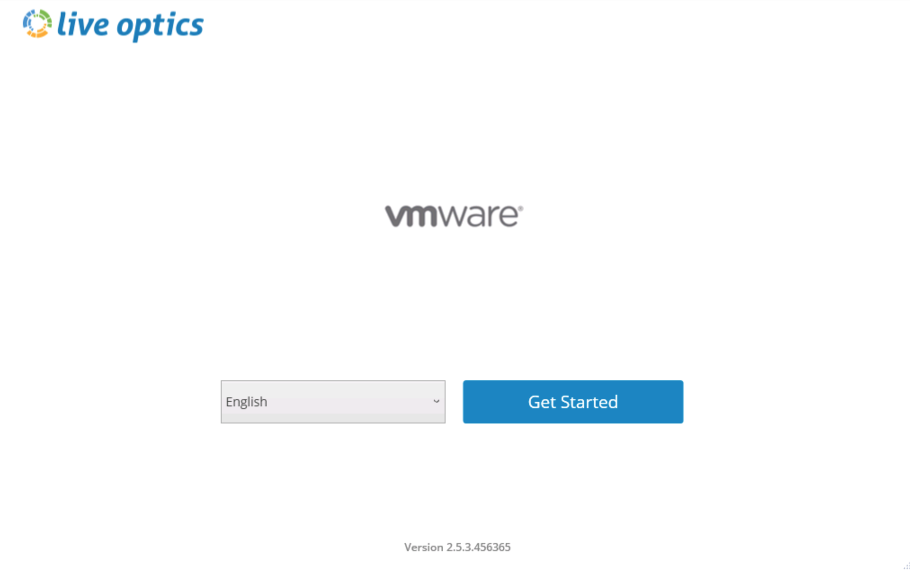

Click **Yes, I Agree** on the Terms and Conditions.

Confirm the user account information for Live Optics, and click **Yes, It Is Correct**.

Select **Server & Virtualization**, and click **Start ->** on **Optical Prime** (Formally known as DPACK).

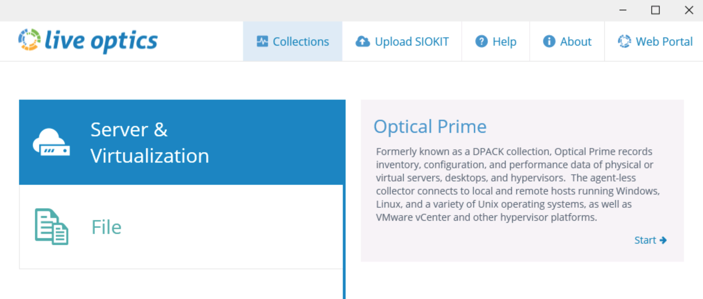

Next choose if you want to connect to the Live Optics web service (automatically uploads SIOKIT), or if you want to run in standalone mode (requires manual upload of SIOKIT).

Make your selection, and click **Next**. For this exercise we are selecting not to connect to Live Optics web service.

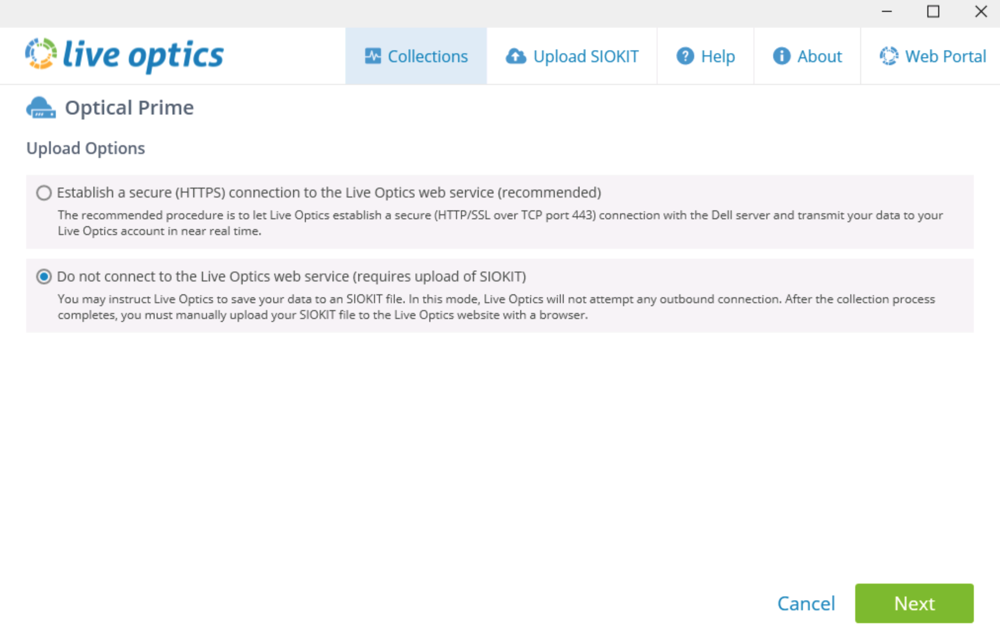

.. note::

  If you choose to connect to Live Optics web service you can choose a collection time from 10 minutes to 7 days. If you choose to not connect to Live Optics web service (standalone mode), your options are 10 minutes to 24 hours.

Click **Add Remote Server**.

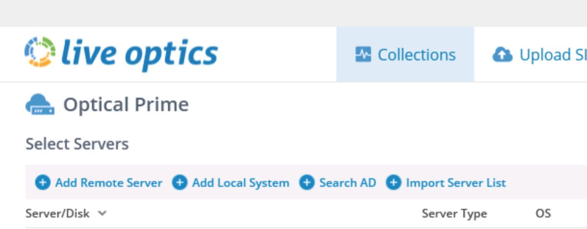

Select the option to connect to VMware vCenter Server, enter the vCenter URL, and then click **Connect**.

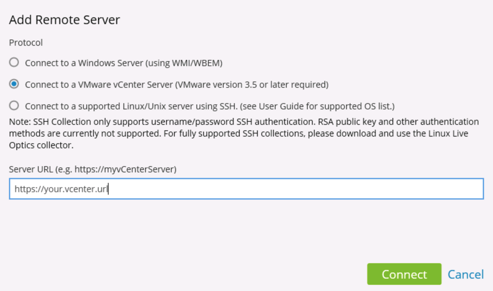

Enter vCenter username and password, then click **Ok**.

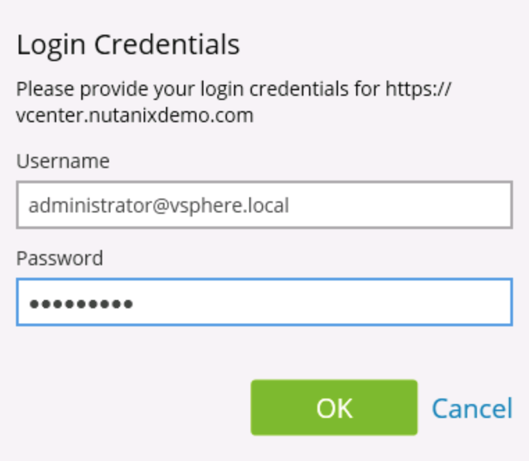

Verify the VMware Clusters and Datacenters are correct, and click **Ok**.

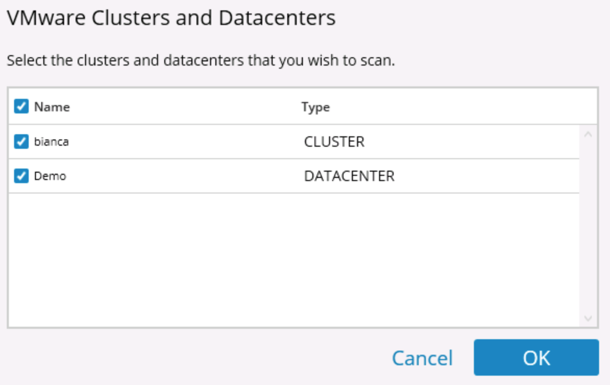

Select the capture duration, and click **Start Capture**. For this exercise we will use 10 minutes.

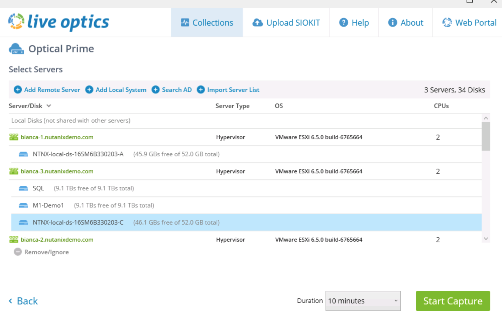

When the collection completes, it will put the SIOKIT it generates in the same directory as the **LiveOpticsDotNet4_5.exe**.

Now, in a web browser open https://www.liveoptics.com and login.

Click on **Upload SIOKIT**.

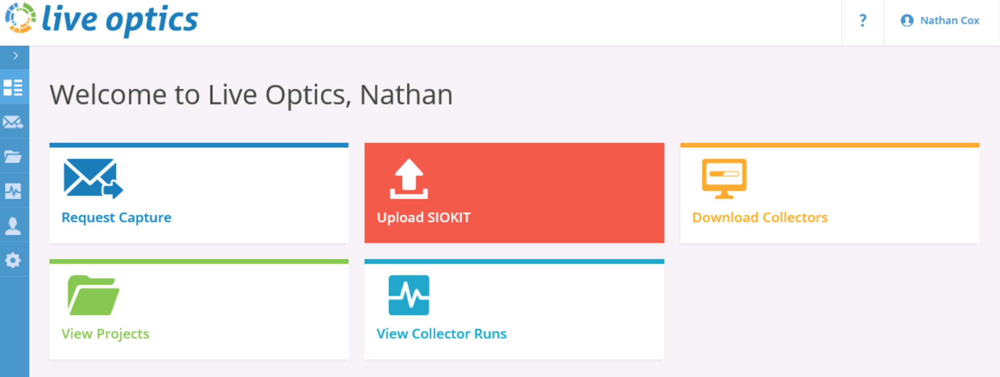

Select **Optical Prime** for the collection type, and click **Next**.

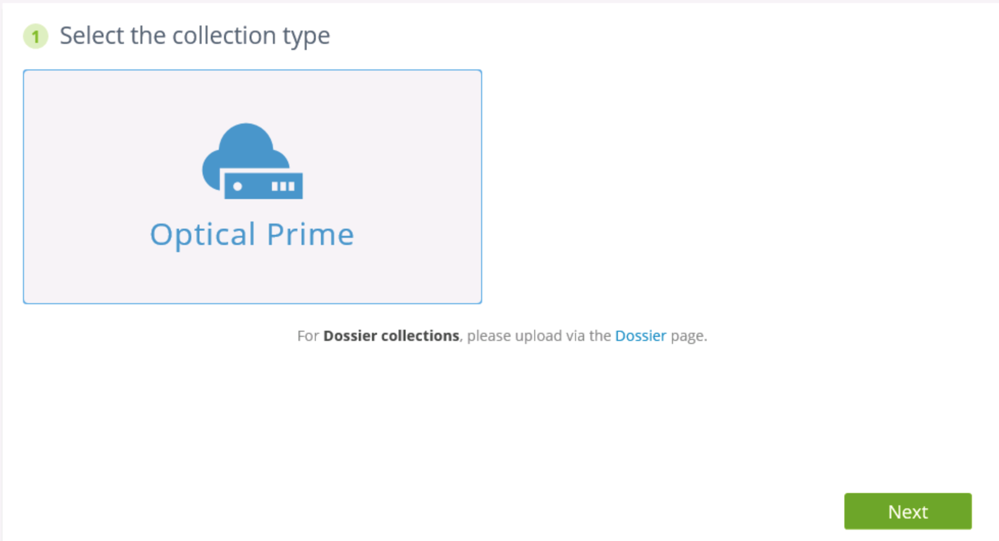

Enter a project name, and click **Next**.

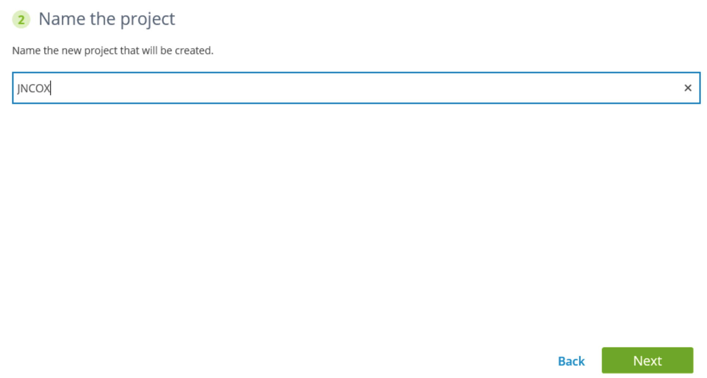

Browse to the SIOKIT file that was generated, and click **Upload**.

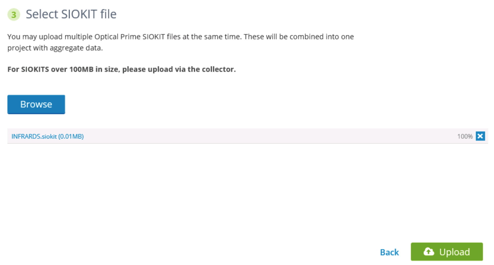

Review Live Optics Collection
+++++++++++++++++++++++++++++

Go to **View Projects**.

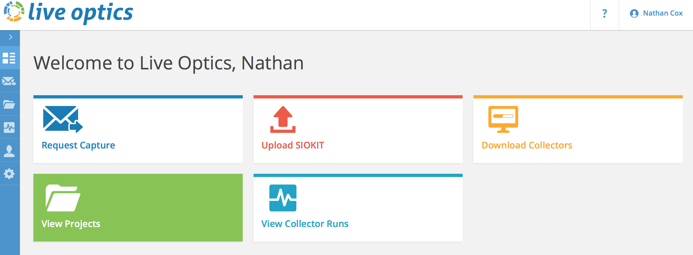

You should now see the project we created previously.

To review the findings, click **Actions** and select **View Project**.

You have 2 views to look at the data. The Environment View, and the Performance View.

These provide information that you can use to size the platform (Storage activity, CPU, RAM, etc.)

The Environment View.

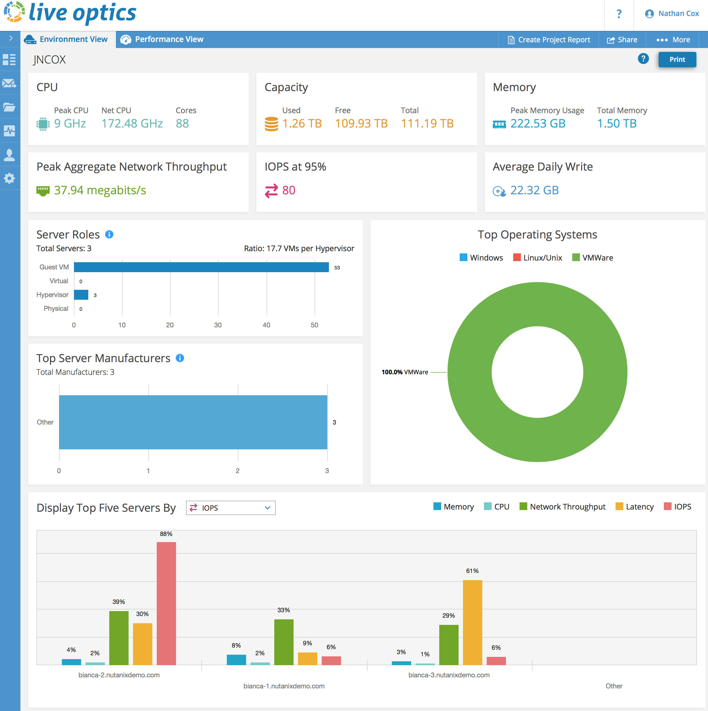

The Performance View.

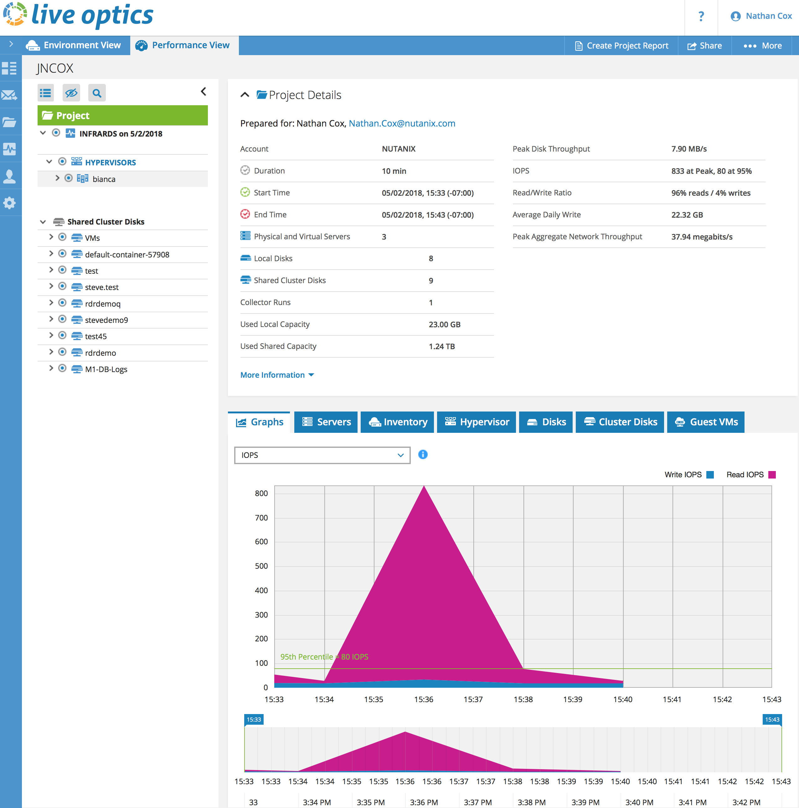

You can take this data, and present it in a report to a prospect or customer in Power Point or PDF format.

To generate these reports, go to **View Projects**, click **Actions** and select **View Reports**.

You now have the option to select what you want to include in the Power Point and/or PDF report. Select the options you would like, and click **Create Report**.

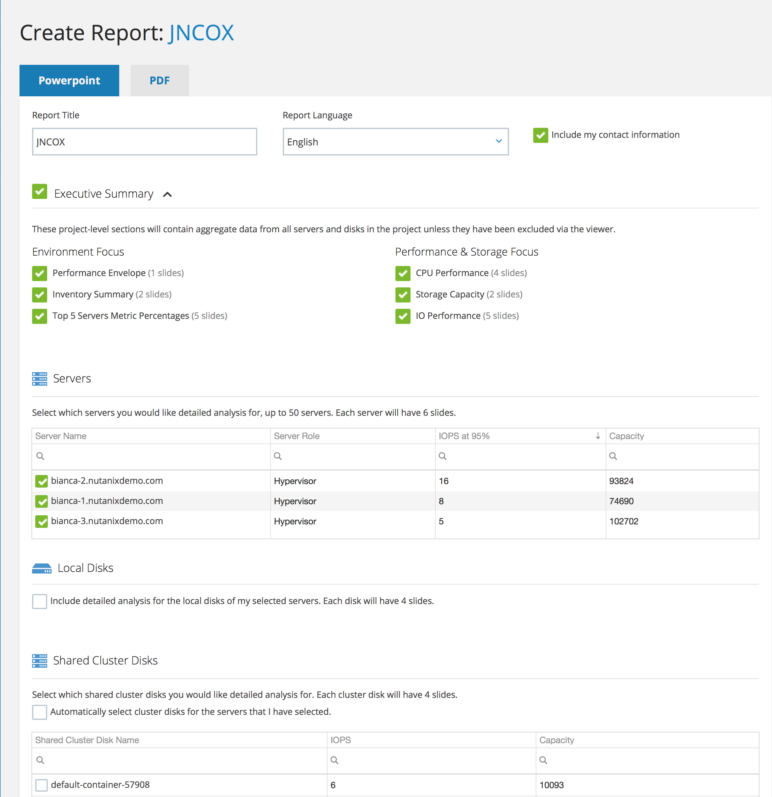

Going through a Live Optics report during a meeting with your customer provides added value for several reasons:

- Obtaining the trust of the prospect by demonstrating the limits of the existing infrastructure (Read / Writes latency, Queue Depth, Databases local dumps via scripts might generate huge writes during backup windows).
- Demonstrate that the sizing you’ve provided covers all existing workloads (Most competitors do their sizing solely based on RVTools, if anything).
- Some metrics can be very useful can only be found in the project and are missing in the PDF report.

Takeaways
+++++++++

- Live Optics can be a useful tool for collecting more then just a "point in time" look at a prospect or customers environment.
