.. _rvtools:

-------------
RV Tools
-------------

Overview
++++++++

Instructions to use data collected with RVTools to size a Nutanix platform.

What is RVTools
+++++++++++++++

RVTools is a windows .NET application which uses the VI SDK to display information about your virtual machines and ESX hosts. RVTools is able to list information about VMs, CPU, Memory, Disks, Partitions, Network, Floppy Drives, CD drives, Snapshots, VMware tools, Resource pools, Clusters, ESX hosts, HBAs, Nics, Switches, Ports, Distributed Switches, Distributed Ports, Service consoles, VM Kernels, Datastores, Multipath info and health checks.  

Download RVtools: http://www.robware.net/

Installing RVTools
++++++++++++++++++

To install RVTools follow these steps:

- Run installer file (RVTools_3.8.6.msi) on a Windows system

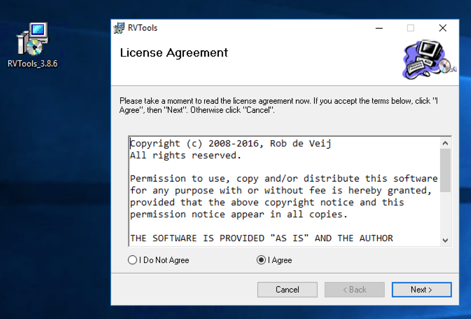

- Choose an install folder

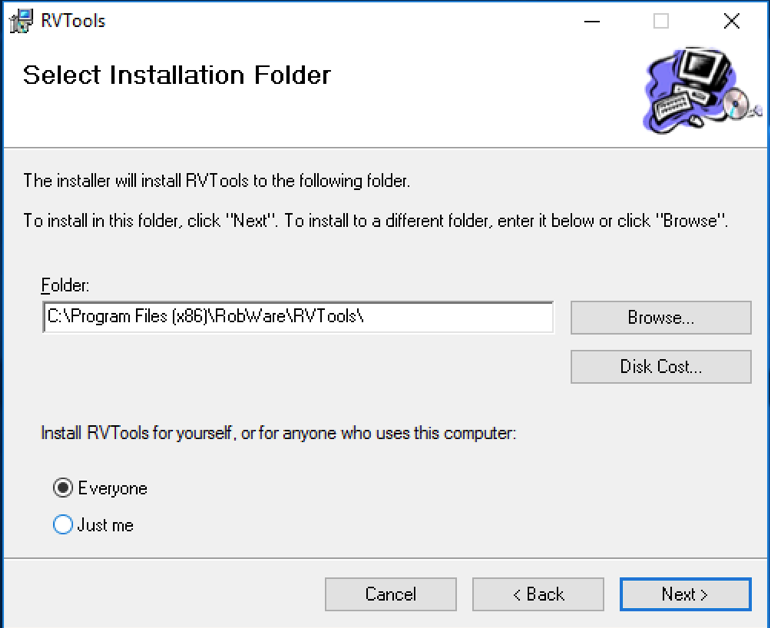

- Finish installation process

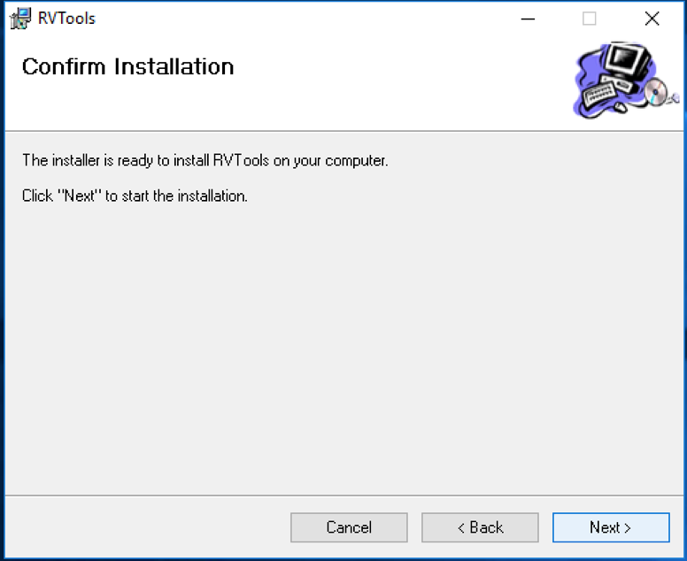

Running RVTools and Exporting Results
+++++++++++++++++++++++++++++++++++++

Use the following steps to run RVTools, and export the results:

- Run RVTools and provide vCenter (or each ESX host) credentials

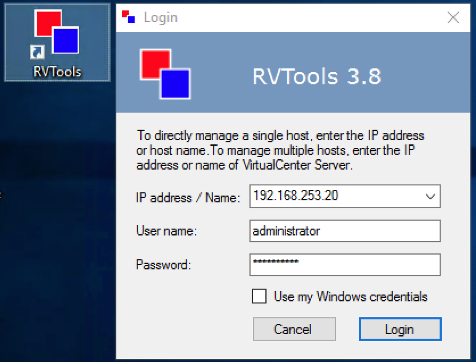

- RVTools will collect all of you virtual environment information and display it as a table

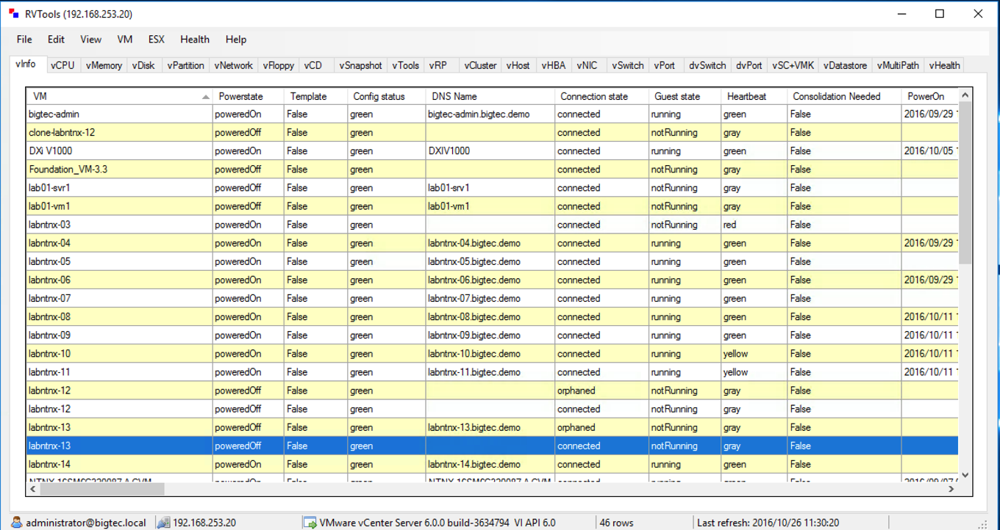

- Export the result as Excel format: File > Export all to Excel

.. figure:: images/rvtools_06.png

- Provide a folder and a name for the file

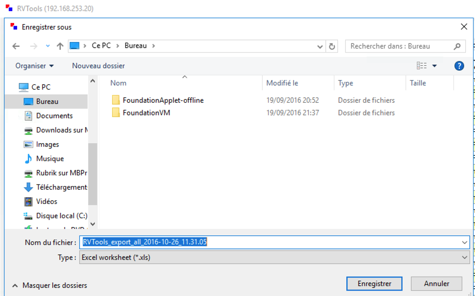

Getting the Numbers for Sizer
+++++++++++++++++++++++++++++

Now lets get the VM information we need from RVTools, and see where that information goes in Sizer.

Getting the number of VMs
.........................

On tab tabvInfo in RVTools Excel extract, column A list the name of VMs. Select all the VMs and get the number as indicated in « Count » in the Excel footer:

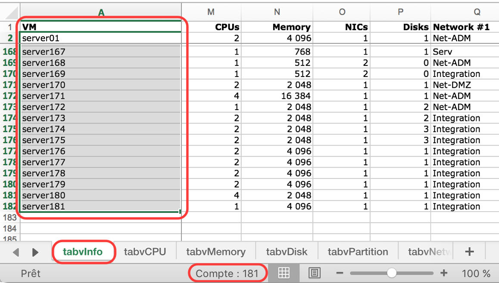

In the Sizer, provide the number of VMs:

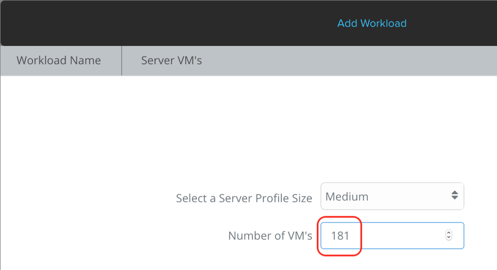

Getting the VM’s average vCPU and Memory
........................................

We need to get the average vCPU and RAM per VM from the tabvInfo tab. Below you can see we sum up the vCPU of the VMs (M column) and divide it by the number of VMs. Same thing for the Memory (N column).

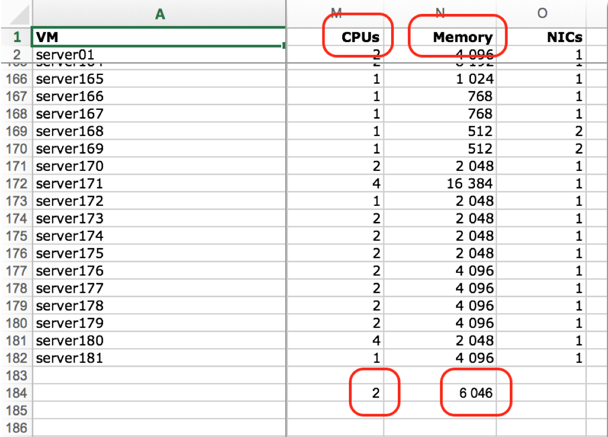

In the Sizer, provide the average vCPU and RAM values:

.. figure:: images/rvtools_11.png

Get the storage used
....................

In tabvPartition tab, add a column named Used Capacity after Free MB (F column). Add a formula to subtract Free MB (F) to Capacity MB (E). In the example below: =E2-F2 (Repeat that formula until the last line).

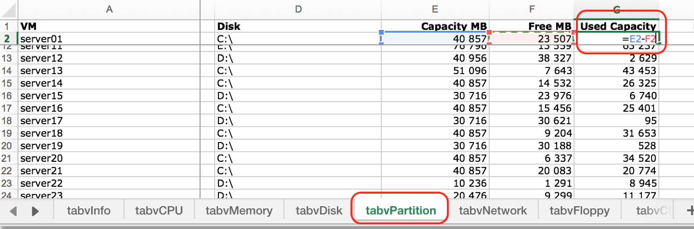

Sum up the new Used Capacity column:

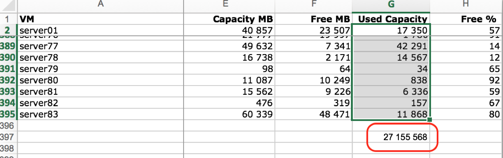

Divide the sum Used Capacity (27 155 568 MB in this example) by the number of VMs (181 VMs here). The average storage per VM here is 150,03 GB.

In the Sizer, provide the quantity of storage in GiB* (140GiB).

Split the storage amount between Cold Data and Hot Data (Based on DPACK results or a ratio, like 10% Hot/Cold)

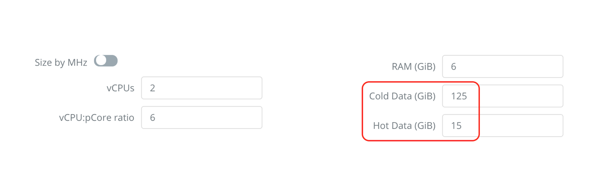

.. note:: You can use Google to convert GigaByte to GibiByte

  .. figure:: images/rvtools_15.png

Takeaways
+++++++++

- RVTools can be very useful to capture the information we need to size Nutanix workloads.
